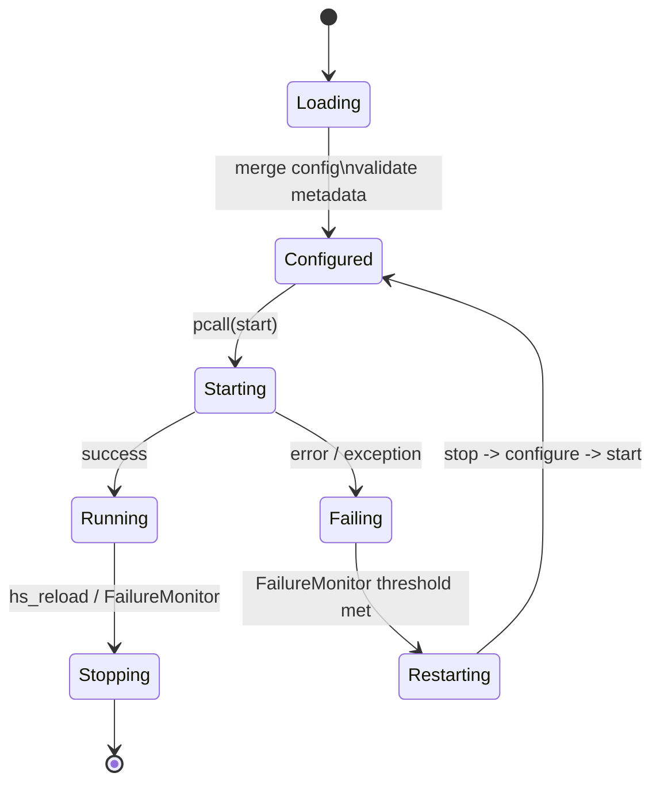

# Design Document

## Overview

The automation suite currently bootstraps modules in [init.lua](init.lua:5), wiring Zoom focus handlers, Spotify volume shortcuts, Finder toolbar theming, camera activity listeners, and location-aware audio logic. To satisfy the new flexibility, observability, and resiliency requirements, the design introduces a unified module lifecycle registry, structured error propagation, and enhanced configuration validation. The design preserves the existing module boundaries under [modules/camera.lua](modules/camera.lua:1), [modules/location.lua](modules/location.lua:1), and peers while adding cross-cutting services that make it safer to expand automation coverage.

Key goals:

- Standardise module metadata, configuration merging, and lifecycle hooks so new modules can be dropped into the system with minimal ceremony.
- Harden runtime watchers (camera, wifi, power, etc.) against transient Hammerspoon or macOS API issues via supervised restarts.
- Improve console observability with summarised initialisation, structured error logs, and dependency-aware alerts.

## Architecture

The solution adds a small core layer on top of the existing bootstrap sequence:

1. [init.lua](init.lua:5) delegates module loading to a new [ModuleRegistry](modules/registry.lua:1) that encapsulates `require`, configuration merging, and lifecycle start/stop with `pcall`.
2. A [ConfigValidator](modules/config_validator.lua:1) inspects [config.lua](config.lua:7) and module metadata to surface missing or invalid keys before modules start.
3. A [FailureMonitor](modules/failure_monitor.lua:1) records module-level failure counts and exposes console commands (e.g. `hs_reload_module('camera')`) for hot restarts.
4. Modules may register watcher callbacks (camera, wifi, power). Each watcher is wrapped by a [WatcherSupervisor](modules/watcher_supervisor.lua:1) that auto-restarts on failure and routes structured logs to `hsm.log`.
5. Observability is centred on `hsm.log` with augmented alerts through `hs.alert` when external dependencies report actionable failures.

## Components and Interfaces

### ModuleRegistry (modules/registry.lua)

- Responsibilities: discover module list, safely require modules, merge configuration, and invoke lifecycle hooks.
- Interfaces:
  - [ModuleRegistry.loadModule(name)](modules/registry.lua:5) → returns module table or `nil, err`.
  - [ModuleRegistry.configureModule(mod, cfg)](modules/registry.lua:25) → deep merges `cfg` into `mod.config`.
  - [ModuleRegistry.startModule(mod)](modules/registry.lua:60) / [ModuleRegistry.stopModule(mod)](modules/registry.lua:90) → wraps `mod.start`/`mod.stop` in `pcall`, logging via `hsm.log`.
  - [ModuleRegistry.reloadModule(name)](modules/registry.lua:120) → convenience invoked by console command.

- Integration: [init.lua](init.lua:63) replaces direct `hs.fnutils.each` loops with registry iteration, enabling structured logging and failure reporting.

### ConfigValidator (modules/config_validator.lua)

- Validates `config.global.paths` in [config.lua](config.lua:7) before use, ensuring directories exist (or logging fallback) and that each module’s metadata-declared required keys are present.
- Interface: [ConfigValidator.validate(globalConfig, moduleMetas)](modules/config_validator.lua:10) returns table of warnings; [init.lua](init.lua:64) logs them and continues with safe defaults.

### FailureMonitor (modules/failure_monitor.lua)

- Tracks counts and timestamps of failures per module. Exposes threshold configuration (default from `config.global.failurePolicy`).
- Interfaces:
  - [FailureMonitor.record(name, event, err)](modules/failure_monitor.lua:15) increments counters and logs structured entries.
  - [FailureMonitor.shouldRestart(name)](modules/failure_monitor.lua:45) decides if automatic restart is warranted.
  - Binds console helpers: `hs_reload_module` uses [FailureMonitor.restart(name)](modules/failure_monitor.lua:70) to call back into `ModuleRegistry.reloadModule`.

### WatcherSupervisor (modules/watcher_supervisor.lua)

- Provides decorator for watcher constructors used in [modules/camera.lua](modules/camera.lua:45) and [modules/location.lua](modules/location.lua:94).
- Interface: [WatcherSupervisor.wrap(createWatcherFn, opts)](modules/watcher_supervisor.lua:8) returns a start/stop pair that retries once on failure and logs dependency metadata.
- Uses `hs.timer.doAfter` for delayed restart windows[2].

### NotificationBridge (modules/notification_bridge.lua)

- Extends existing logging with targeted console notifications when dependencies (`hs.shortcuts`, `hs.spotify`, `hs.application`) fail.
- Implementation: helper [NotificationBridge.alertFailure(moduleName, dependency, action, err)](modules/notification_bridge.lua:5) combines `hsm.log.e` with `hs.alert.show` for quick visibility[3].

### Module Metadata Contract

- Each module exports `metadata = { description, version, configDefaults, requiredConfigKeys, watchers = {...} }`.
- Example additions:
  - Planned addition: [modules/camera.lua](modules/camera.lua:1) will define `metadata.watchers.camera = { restart = true }`.
  - Planned addition: [modules/zoom.lua](modules/zoom.lua:1) will declare dependency list `{'hs.shortcuts', 'Zoom.spoon'}` for alert messages.

## Data Models

- `ModuleDefinition`: `{ name, instance, metadata, config, state, failureStats }`.
- `FailureStats`: `{ count, windowStart, lastError, lastRestart, buffer = circularQueue }`.
- `WatcherDescriptor`: `{ id, startFn, stopFn, restartPolicy = { retries = 1, backoff = 2 } }`.
- Config extensions in [config.lua](config.lua:14):
  - `config.global.failurePolicy = { windowSeconds = 300, maxErrors = 3 }`.
  - Module defaults merged via `metadata.configDefaults` to avoid overwriting in-file fallbacks.
- Validation results: `warnings = { { module, key, message, fallback } }` for logging.

## Error Handling

- All lifecycle calls (`require`, `start`, `stop`) use `pcall`, with errors passed to [FailureMonitor.record()](modules/failure_monitor.lua:15) before rethrow/log.
- Watcher callbacks wrapped by `WatcherSupervisor` to catch runtime errors and perform single restart attempt; persistent failures escalate to FailureMonitor.
- External dependency calls (e.g. `hs.shortcuts.run` in [modules/camera.lua](modules/camera.lua:39) and [modules/zoom.lua](modules/zoom.lua:16), `hs.spotify` in [modules/spotify.lua](modules/spotify.lua:12)) guard failures by checking return values and routing through [NotificationBridge.alertFailure()](modules/notification_bridge.lua:5).
- Configuration validation logs warnings (not fatal) via `hsm.log.w`, allowing system to continue with safe defaults.

## Testing Strategy

- Console-driven smoke checks:
  - `ModuleRegistry` dry-run to ensure all modules load without executing `start`.
  - Simulate dependency failures by temporarily overriding `hs.shortcuts.run` and verifying FailureMonitor counters and alerts.
- Manual watcher tests:
  - Trigger camera connect/disconnect to observe supervised restart logs.
  - Toggle Wi-Fi networks and power source to confirm location module reacts after restart.
- Logging verification:
  - Ensure initialisation summary emitted once by [init.lua](init.lua:63).
  - Confirm warnings appear for intentionally removed config keys.
- Future automation: consider lightweight Lua-spec-based tests for registry helpers once infrastructure allows.

## References

1. Hammerspoon Logger documentation[1]
2. Hammerspoon Timer utilities[2]
3. Hammerspoon Alert API[3]

[1]: https://www.hammerspoon.org/docs/hs.logger.html
[2]: https://www.hammerspoon.org/docs/hs.timer.html
[3]: https://www.hammerspoon.org/docs/hs.alert.html
